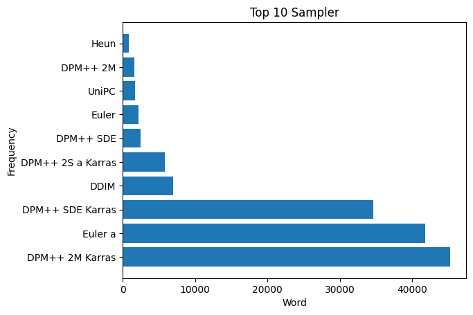

## civitai-analysis

```bash
$ find ./data -type f -name "*.txt" -print0 | xargs -0 wc -l | tail -1

181384 total
```

抓取 C 站 181384 张 `SFW` 图片数据抓取后：

- 玩家最喜欢的模型是`chilloutmix_NiPrunedFp32Fix`[`fc2511737a`]
- 玩家最常用的正向指令是`masterpiece`、`best quality`、`1girl`、`solo`
- 玩家最常用的反向指令是`blurry`、`low quality`、`bad anatomy`
- 玩家生成图片尺寸最多的是`512x768`，其次是默认的`512x512`
- 玩家采样步数使用最多的是`20`
- 玩家采样器使用最多的是`DPM++ 2M Karras`，其次是默认的`Euler a`
- 玩家无分类指导规模值使用最多的是`7`

然后，我粗略的统计了指令中出现`girl`和`boy`的次数，然后出现`girl` 64251 次，出现`boy` 12053 次，只占了6.4%。dddd。

## Model


## Sampler



## Steps


## Size


## CfgScale


## Prompt


